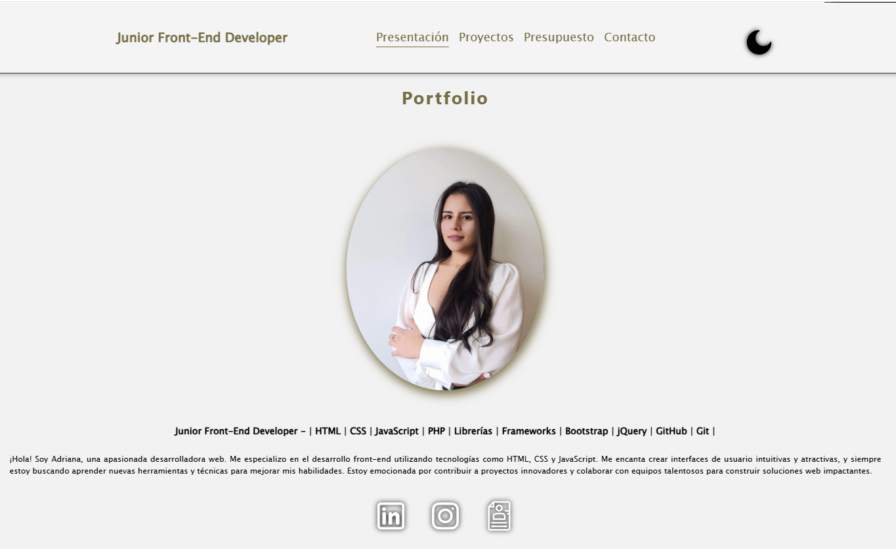

<h1 align="center">Hola, soy Adriana Rojas </h1>

 ## Sobre Mi 

⭐ Soy una programadora web apasionada y creativa con conocimiento en los siguientes lenguajes de programación ⭐ 

 

- HTML
- CSS
- JavaScript
- PHP
- MySQL

A lo largo de mi formación he desarrollado creaciones de archivos y maquetación HTML5, diseño web CSS3, SASS, SCSS, programación JavaScript, manejo de bases de datos relacionales MySQL, programación PHP. Apache, Manejo de diferentes distribuciones de Linux y administración de servidores web. Diseño con Boostrap, Materialize, Angular, GitHub.

Creando soluciones web efectivas y atractivas que mejoran la experiencia del usuario, estoy lista para contribuir a proyectos innovadores y colaborar en equipos dinámicos. Mi enfoque proactivo y mi capacidad para resolver problemas me permiten adaptarme rápidamente a nuevos desafíos.
 

## Lenguajes

<h4> Languajes </h4>
 
  
  
  
  
  
  
  

<h4> Otras Tecnologías </h4>

  
  
  
  
  
  
  
  
  
  
  
  
  
  
  
   

## Check out my Social Media

## Proyectos 
<table>
<tr>
<td width="50%">
<h3 align="center">Mi Primera Web</h3>

<a href="https://adriana-rojas0.github.io/Adriana_Rojas1_TrabajoJAVASCRIPT/" target="_blank">
 

</a>

Mi proyecto es un sitio web tipo portfolio. Trabajo en el utilizando <strong>tecnologías como JSON, JavaScript, HTML y CSS, integrando elementos dinámicos como formularios, Google Maps y galerías</strong>. Está enfocado en soluciones atractivas y funcionales en el ámbito del Front-End, con el objetivo de mejorar la experiencia del usuario.

                                                                                      
</td>

<td width="50%">
                
<h3 align="center">Web Coffee</h3>

                                       

 

<a href="https://adriana-rojas0.github.io/Web-Cafe/" target="_blank">
 

Este proyecto es una <strong>plataforma web adaptable, desarrollada con Django</strong>, que recrea la experiencia digital de un café contemporáneo. La aplicación cuenta con una galería de productos, un formulario de contacto interactivo y un panel de administración intuitivo. Con un backend robusto en Python/Django, el sistema gestiona pedidos y consultas de manera eficiente, asegurando un entorno ágil y seguro para su despliegue en producción.

                                                             
</table>                                                                                 

 

<table>
<tr>
<td width="50%">
<h3 align="center">Store</h3>

<a href="https://adriana-rojas0.github.io/Store/" target="_blank">
 

Esta web es una <strong>tienda online de guitarras construida con React</strong>. Permite a los usuarios ver una colección de guitarras, agregarlas a un carrito de compras, modificar la cantidad de cada producto, eliminar productos del carrito y vaciar el carrito por completo. El estado del carrito y la colección de productos se maneja con React hooks. El diseño está basado en Bootstrap y estilos personalizados definidos en App.css. La aplicación se inicia desde main.jsx y se configura con Vite para un desarrollo rápido.

                                                                                      
</td>       

<td width="50%">
<h3 align="center">Portfolio</h3>

<a href="https://github.com/Adriana-Rojas0 target="_blank">
 

<strong>Bienvenido a mi portfolio</strong> 
Soy una apasionada del desarrollo web con experiencia en la creación de interfaces dinámicas y atractivas. En este espacio, comparto mi trayectoria, desde mi formación hasta los proyectos en los que he trabajado. Cada proyecto ha sido una oportunidad para aprender, innovar y perfeccionar mis habilidades en el desarrollo Front-End.
En este sitio muestro no solo lo que he construido, sino también mi visión sobre la creación de experiencias digitales que marquen la diferencia. Explora mi trabajo y descubre cómo puedo aportar valor a nuevos desafíos.

                                                                                    
</td> 
</table> 

<table>
 

  <td width="50%">
<h3 align="center">Calculator</h3>

<a href="https://github.com/Adriana-Rojas0 target="_blank">
 

<strong>Calculator, React/TypeScript.</strong> Esta web es una calculadora de propinas desarrollada con <strong>React y TypeScript</strong>. Permite a los usuarios seleccionar productos de un menú, agregarlos a una orden, ver el resumen de lo pedido, elegir el porcentaje de propina y calcular el total a pagar, incluyendo la propina. La interfaz está dividida en dos partes: el menú de productos y el resumen de la orden, donde se puede modificar la selección y calcular el pago final. Para los estilos visuales se utiliza <strong>Tailwind CSS</strong>. Es una herramienta moderna y visualmente atractiva, ideal para calcular fácilmente el pago total en restaurantes o cafeterías.

                                                                                    
</td> 
 

 

  <td width="50%">
<h3 align="center">Máquinas Virtuales</h3>

<a href="https://github.com/Adriana-Rojas0" target="_blank">
 

<strong>Máquinas Virtuales, Servidores Web (Apache)</strong> La creación de MVpermiten ejecutar un sistema operativo y aplicaciones como si estuvieran en un hardware físico independiente. Además, la implementación de un virtual hot y medidas de seguridad como HTTPS, SST y la desactivación del listado de directorios ayuda a proteger la información de los usuarios y garantiza la confiabilidad del sitio web. En general, las MV facilitan el desarrollo de aplicaciones y sitios web, ofreciendo un entorno seguro y eficiente.

                                                                                    
</td> 
 

</table>

 

### ⚙️ &nbsp;GitHub Analytics

